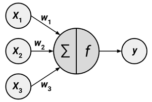
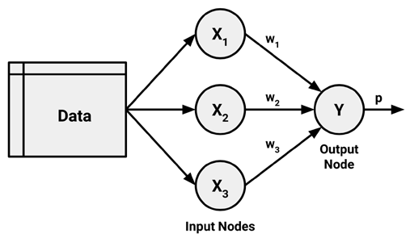
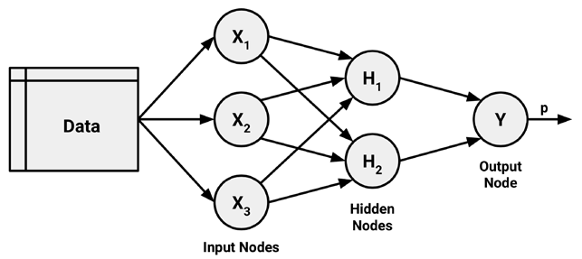
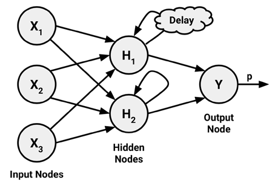
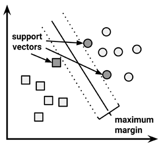

# Neural Networks

An **Artificial Neural Network (ANN)** models the relationship between a set of input signals and an output signal using a model derived from our understanding of brains. Brains use a network of interconnected cells called **neurons** to create a massive parallel processor, ANN uses a network of **nodes** to solve learning problems.

A directed network diagram defines a relationship between the input signals ($x_i$ variables), and the output signal ($y_i$ variable). Each input signal is weighted ($w_i$ values) according to its importance. The input signals are summed and the signal is passed on according to an **activation function** $f$:

{style=".center {   display: block;   margin-left: auto;   margin-right: auto;    }" width="50%"}

A typical artificial neuron with n inputs can be represented by the formula:

$$
y(x) = f \left( \sum^n_{i = 1} w_i x_i \right)
$$

Although there are numerous variants of neural networks, each can be defined in terms of the following characteristics:

-   An **activation function**, which transforms a neuron's combined input signals into a single output signal to be broadcasted further in the network
-   A **network topology** (or architecture), which describes the number of neurons in the model as well as the number of layers and manner in which they are connected
-   The **training algorithm** that specifies how connection weights are set in order to inhibit or excite neurons in proportion to the input signal

## Activation Functions

In biology, the activation function sums the total input signals and determines whether it meets the firing threshold to pass on the signal; otherwise, it does nothing.This is known as a **threshold activation function**. The simplest threshold activation function is the **step function**:

$$
f(x) = \begin{cases} 
  0 & x \lt 0 \\
  1 & x \ge 0 
\end{cases}
$$

```{r}
library(tidyverse)

step_fn <- function(x) ifelse(x < 0, 0, 1)

ggplot(data = data.frame(x = 0), mapping = aes(x = x)) +
  stat_function(fun = step_fn) + 
  xlim(-10, 10)
```

However, this is rarely used in ANN, where the activation function can be chosen for other desirable properties. The most commonly used alternative is the **sigmoid activation function**, which is similar but differentiable and the output is no longer binary.

$$
f(x) = \frac{1}{1 + e^{-x}}
$$

```{r}
sigmoid_fn <- function(x) 1 / (1 + exp(-x))

ggplot(data = data.frame(x = 0), mapping = aes(x = x)) +
  stat_function(fun = sigmoid_fn) + 
  xlim(-10, 10)
```

The choice of activation function biases the neural network such that it may fit certain types of data more appropriately. For instance, a **linear activation function** results in a neural network very similar to a linear regression model, while a **Gaussian activation function** results in a model called a **Radial Basis Function** (RBF) network.

for many of the activation functions, the range of input values that affect the output signal is relatively narrow. For example, in the case of sigmoid, the output signal is always nearly 0 or 1. The compression of signal in this way results in a saturated signal at the high and low ends of very dynamic inputs. Such functions are known as **squashing functions**.

The solution to the squashing problem is to transform all neural network inputs such that the features' values fall within a small range around 0. Typically, this involves standardizing or normalizing the features.

## Network Topology

The ability of a neural network to learn is rooted in its **topology**, or the patterns and structures of interconnected neurons. Topologies can be differentiated by three key characteristics:

-   The number of layers
-   Whether information in the network is allowed to travel backward
-   The number of nodes within each layer of the network

Generally, larger and more complex networks are capable of identifying more subtle patterns and complex decision boundaries. However, the power of a network is not only a function of the network size, but also the way units are arranged.

### Number of Layers

The figure below illustrates the topology of a very simple network. A set of neurons called **input nodes** receives unprocessed signals directly from the input data. Each input node is responsible for processing a single feature in the dataset; the feature's value will be transformed by the corresponding node's activation function. The signals sent by the input nodes are received by the output node, which uses its own activation function to generate a final prediction (denoted here as $p$).

Because the input nodes process the incoming data exactly as it is received, the network has only one set of connection weights (labeled here as $w_1$, $w_2$, and $w_3$). It is therefore termed a **single-layer network**.

{style=".center {   display: block;   margin-left: auto;   margin-right: auto;    }" width="50%"}

More complex networks can be created by adding additional layers. A **multilayer network** adds one or more **hidden layers** that process the signals from the input nodes prior to it reaching the output node. Most multilayer networks are **fully connected**, which means that every node in one layer is connected to every node in the next layer, but this is not required.

{style=".center {   display: block;   margin-left: auto;   margin-right: auto;    }" width="50%"}

### The direction of information travel

Networks in which the input signal is fed continuously in one direction from connection to connection until it reaches the output layer are called **feedforward networks**. A neural network with multiple hidden layers is called a **Deep Neural Network** (DNN) and the practice of training such network is sometimes referred to as **deep learning**.

In contrast, a **recurrent network** (or **feedback network**) allows signals to travel in both directions using loops. This property, which more closely mirrors how a biological neural network works, allows extremely complex patterns to be learned. The addition of a short-term memory, or **delay**, increases the power of recurrent networks immensely. Notably, this includes the capability to understand the sequences of events over a period of time.

{style=".center {   display: block;   margin-left: auto;   margin-right: auto;    }" width="50%"}

In spite of their potential, recurrent networks are still largely theoretical and are rarely used in practice. The multilayer feedforward network, sometimes called the **Multilayer Perceptron** (MLP), is the de facto standard ANN topology.

### The number of nodes in each layer

The number of input nodes is predetermined by the number of features in the input data. Similarly, the number of output nodes is predetermined by the number of outcomes to be modeled or the number of class levels in the outcome. However, the number of hidden nodes is left to the user to decide prior to training the model.

The number of hidden nodes depends on the number of input nodes, the amount of training data, the amount of noisy data, and the complexity of the learning task, among many other factors. In general, more complex network topologies with a greater number of network connections allow the learning of more complex problems. The best practice is to use the fewest nodes that result in adequate performance in a validation dataset.

## Training neural networks with backpropagation

The network topology is a blank slate that by itself has not learned anything -- it must be trained with experience. As the neural network processes the input data, connections between the neurons are strengthened or weakened. The network's connection weights are adjusted to reflect the patterns observed over time. The algorithm for training ANNs efficiently, which uses a strategy of back-propagating errors, is known as **backpropagation**.

| Strengths                                                           | Weaknesses                                                                                             |
|---------------------------------------------------------------------|--------------------------------------------------------------------------------------------------------|
| Can be adapted to classification or numeric prediction problems     | Extremely computationally intensive and slow to train, particularly if the network topology is complex |
| Capable of modeling more complex patterns than nearly any algorithm | Very prone to overfitting training data                                                                |
| Makes few assumptions about the data's underlying relationships     | Results in a complex black box model that is difficult, if not impossible, to interpret                |

The backpropagation algorithm iterates through many cycles of two processes. Each cycle is known as an **epoch**. The starting weights are typically set at random. Then, the algorithm iterates through the processes, until a stopping criterion is reached. Each epoch in the backpropagation algorithm includes:

-   A **forward phase** in which the neurons are activated in sequence from the input layer to the output layer, applying each neuron's weights and activation function along the way. Upon reaching the final layer, an output signal is produced.

-   A **backward phase** in which the network's output signal resulting from the forward phase is compared to the true target value in the training data. The difference between the network's output signal and the true value results in an error that is propagated backwards in the network to modify the connection weights between neurons and reduce future errors.

Over time, the network uses the information sent backward to reduce the total error of the network. The technique used to determine how much a weight should be changed is called **gradient descent**. Conceptually, it works similarly to how an explorer in a jubgle might find a path to water. By examining the terrain and continually walking in the direction with the greatest downward slope, the explorer will eventually reach the lowest valley, which is likely to be a riverbed.

The gradient suggests how steeply the error will be reduced or increased for a change in the weight. The algorithm will attempt to change the weights that result in the greatest reduction in error by an amount known as the **learning rate**.

## Example

### Prepare Data

```{r}
library(tidyverse)

concrete <- read_csv("concrete.csv")
concrete
```

```{r}
normalize <- function(x) (x - min(x)) / (max(x) - min(x))

concrete_norm <- concrete |> 
  mutate(across(where(is.double), normalize))

concrete_norm
```

```{r}
concrete_train <- concrete_norm |> slice(1:773)
concrete_test  <- concrete_norm |> slice(774:1030)
```

### Training the model

```{r}
library(tidymodels)
tidymodels_prefer()

concrete_mlp_spec <- mlp(hidden_units = 1) |> 
   set_engine("nnet") |> 
   set_mode("regression")

concrete_mlp_spec
```

```{r}
set.seed(1)

concrete_mlp_train <- concrete_mlp_spec |> fit(strength ~ ., data = concrete_train)
concrete_mlp_train
```

```{r}
concrete_mlp_pred <- concrete_mlp_train |> 
  predict(concrete_test) |> 
  add_column(strength = concrete_test$strength)

cor(concrete_mlp_pred$.pred, concrete_mlp_pred$strength)
```

```{r}
ggplot(concrete_mlp_pred) + 
  geom_point(aes(strength, .pred))
```

### Improving model performance

```{r}
concrete_hidden5_spec <- mlp(hidden_units = 5) |> 
   set_engine("nnet") |> 
   set_mode("regression")

concrete_hidden5_spec
```

```{r}
concrete_hidden5_train <- concrete_hidden5_spec |> 
  fit(strength ~ ., data = concrete_train)

concrete_hidden5_train
```

```{r}
concrete_hidden5_pred <- concrete_hidden5_train |> 
  predict(concrete_test) |> 
  add_column(strength = concrete_test$strength)

cor(concrete_hidden5_pred$.pred, concrete_hidden5_pred$strength)
```

```{r}
ggplot(concrete_hidden5_pred) + 
  geom_point(aes(strength, .pred))
```

# Support Vector Machines

A **Support Vector Machine (SVM)** can be imagined as a surface that creates a boundary between points of data plotted in a multidimensional space that represents examples and their feature values. The goal of a SVM is to create a flat boundary called a **hyperplane**, which divides the space to create fairly homogeneous partitions on either side, separating the classes.

If we restrict ourselves to the case where our hyperplanes are flat, then we call the model **Linear Support Vector Machines**. However, the hyperplanes can be more complex to allow more flexibility in the separation.

Choosing the hyperplanes uses the principle of **Maximum Margin Hyperplane (MMH)**, which creates the greatest separation between the two classes.

The **support vectors** are the points from each class that are the closest to the MMH; each class must have at least one support vector, but it is possible to have more than one. Using the support vectors alone, it is possible to define the MMH.



When two classes are not separable we introduce a **cost parameter**, which applies a weighting to any points on the wrong side of the hyperplane. The higher the cost the harder the model will work to achieve separation.

## Kernel Functions

Another option when classes are not linearly separable is to redefine the feature space. SVMs with **non-linear kernels** add additional dimensions to the data in order to create separation in this way. Essentially, the **kernel trick** involves a process of constructing new features that express mathematical relationships between measured characteristics, which can then be separated with linear hyperplanes.

| Strengths                                                                                                             | Weaknesses                                                                                         |
|-----------------------------------------------------------------------------------------------------------------------|----------------------------------------------------------------------------------------------------|
| Can be used for classification or numeric prediction problems                                                         | Finding the best model requires testing of various combinations of kernels and model parameters    |
| Not overly influenced by noisy data and not very prone to overfitting                                                 | Can be slow to train, particularly if the input dataset has a large number of features or examples |
| May be easier to use than neural networks, particularly due to the existence of several well-supported SVM algorithms | Results in a complex black box model that is difficult, if not impossible, to interpret            |
| Gaining popularity due to its high accuracy and high-profile wins in data mining competitions                         |                                                                                                    |

Kernel functions, in general, are a mapping of the data into another space. Therefore, the general kernel function applies some transformation to the feature vectors $x_i$ and $x_j$ and combines them using the dot product:

$$
K(\overrightarrow{x_i}, \overrightarrow{x}_j) = \phi(\overrightarrow{x_i}) . \phi(\overrightarrow{x_j})
$$

The simplest form is the **linear kernel**:

$$
K(\overrightarrow{x_i}, \overrightarrow{x}_j) = \overrightarrow{x_i} . \overrightarrow{x_j}
$$

The **polynomial kernel** of degree $d$ adds a simple nonlinear transformation of the data:

$$
K(\overrightarrow{x_i}, \overrightarrow{x}_j) = \left( \overrightarrow{x_i} . \overrightarrow{x_j} + 1 \right)^d
$$

The **sigmoid kernel** results in a SVM model somewhat analogous to a neural network using a sigmoid activation function. The Greek letters kappa and delta are used as kernel parameters:

$$
K(\overrightarrow{x_i}, \overrightarrow{x}_j) = \tanh(\kappa \overrightarrow{x_i} . \overrightarrow{x_j} - \delta)
$$

The **Gaussian RBF kernel** is similar to a RBF neural network. The RBF kernel performs well on many types of data and is thought to be a reasonable starting point for many learning tasks:

## Example - Optical Character Recognition

### Prepare Data

```{r}
letters <- read_csv("letterdata.csv") |> 
  mutate(letter = as.factor(letter))
letters
```

```{r}
letters_train <- slice(letters, 1:16000)
letters_test  <- slice(letters, 16001:20000)
```

### Train the model

```{r}
letter_classifier <- 
  svm_linear() |> 
  set_mode("classification") |> 
  set_engine("kernlab") |> 
  fit(letter ~ ., data = letters_train)

letter_classifier
```

### Evaluating the model

```{r}
letter_predictions <- predict(letter_classifier, letters_test) |> 
  bind_cols(letter = letters_test$letter)

prop.table(table(letter_predictions$.pred_class == letter_predictions$letter))
```

### Improving performance

```{r}
letter_classifier_rbf <- 
  svm_rbf() |> 
  set_mode("classification") |> 
  set_engine("kernlab") |> 
  fit(letter ~ ., data = letters_train)

letter_classifier_rbf
```

```{r}
letter_predictions_rbf <- predict(letter_classifier_rbf, letters_test) |> 
  bind_cols(letter = letters_test$letter)

prop.table(table(letter_predictions_rbf$.pred_class == letter_predictions_rbf$letter))
```
